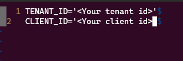
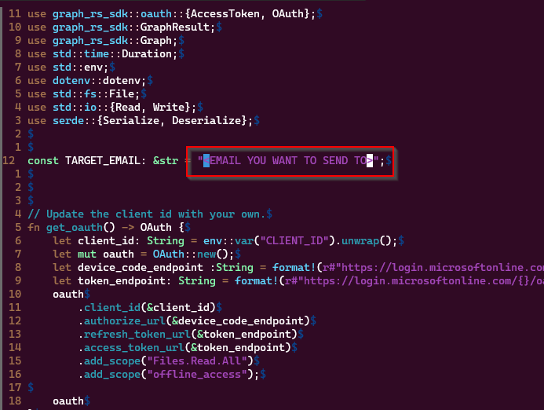

## Simple test app to check caching of tokens

To install

`git clone https://github.com/buhaytza2005/graph-mail`

`cd graph-mail`

`cp .env_sample .env`

Replace the placeholders with the correct CLIENT_ID and TENANT_ID values

Edit the `src/main.rs` file to change the target email - this is the email that will receive the test message

`vim src/main.rs`

`cargo run` 
